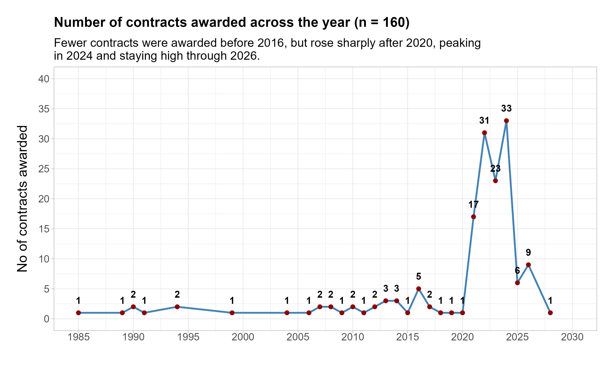
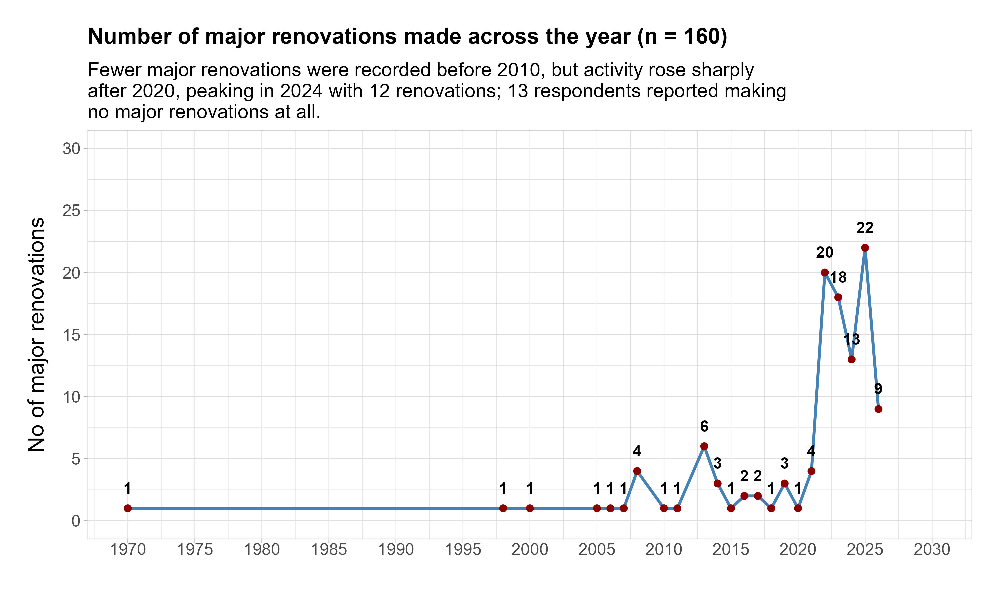
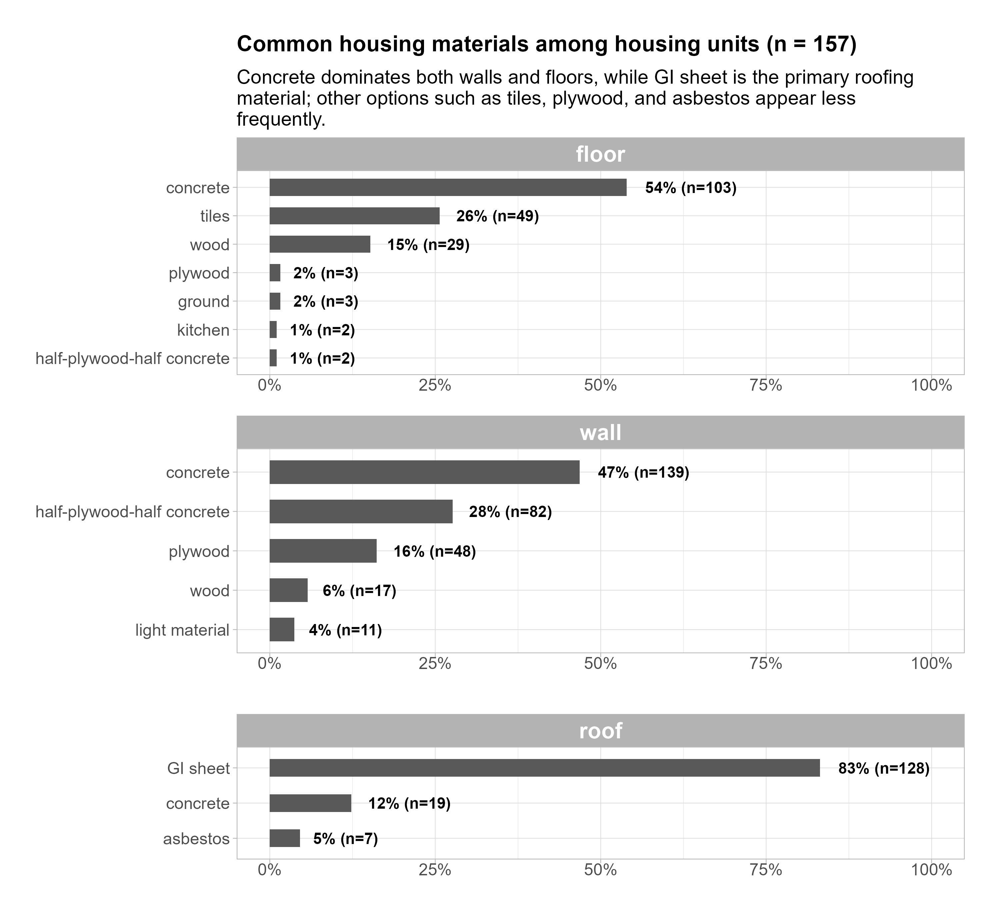
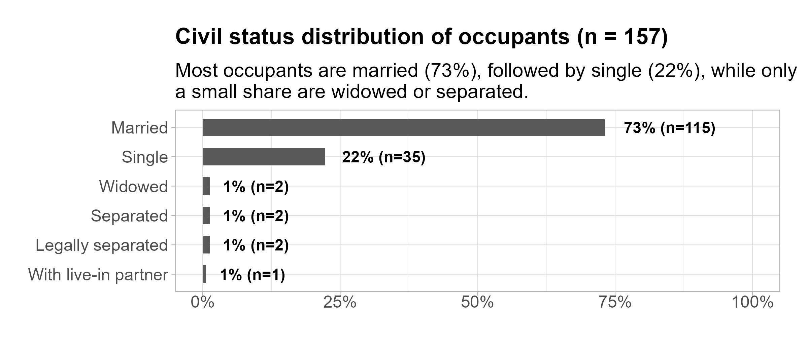
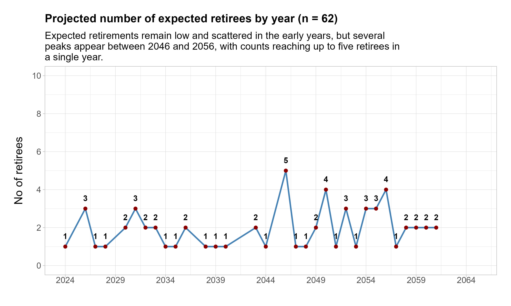
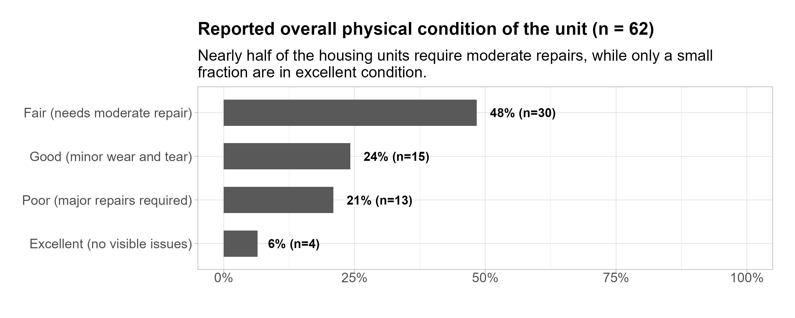
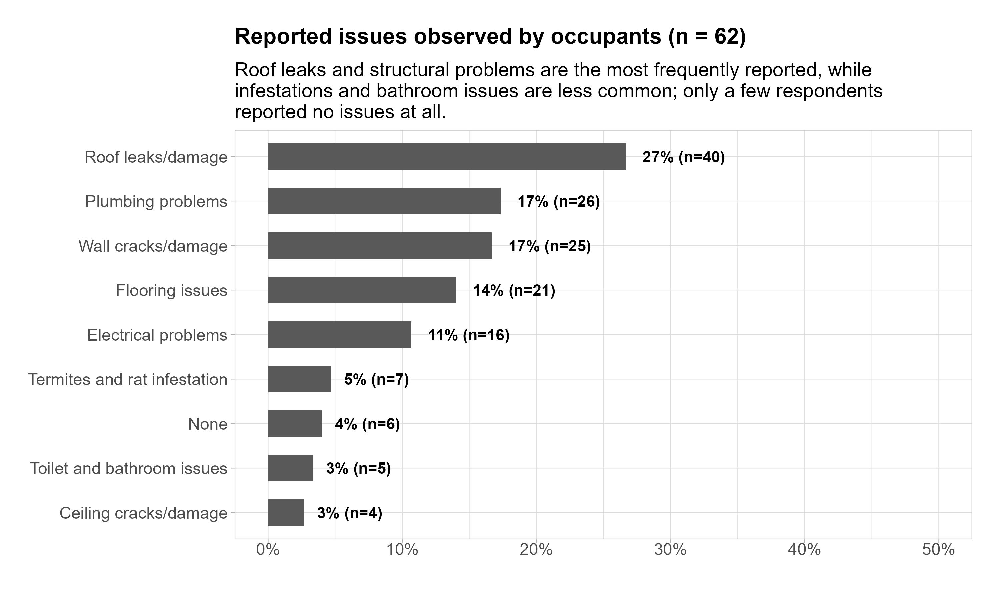
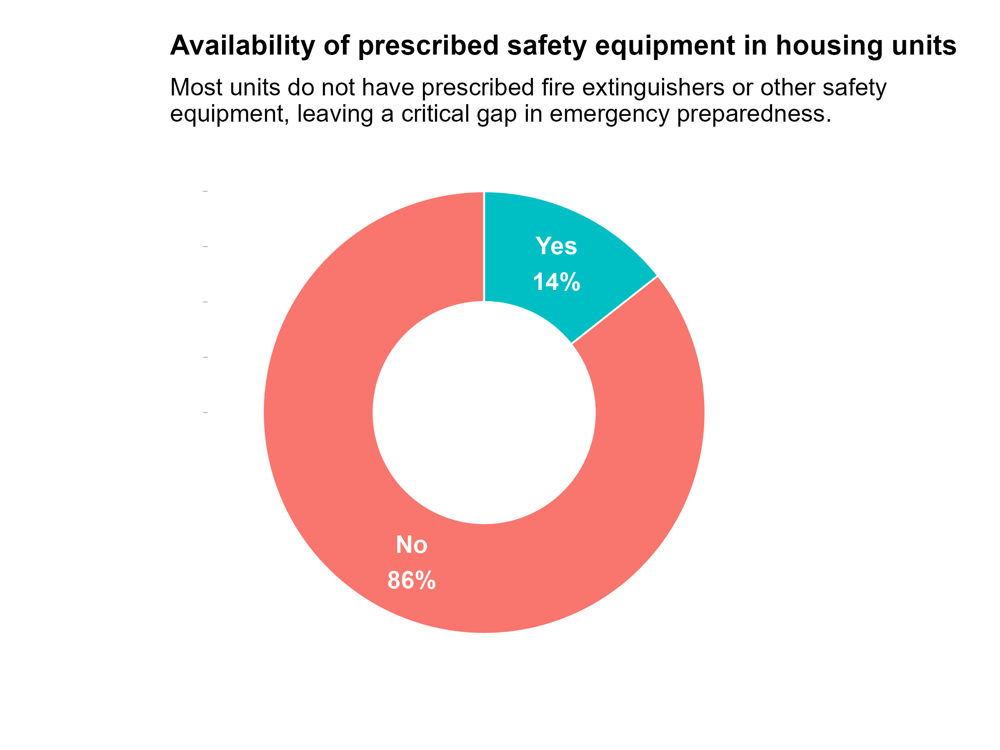
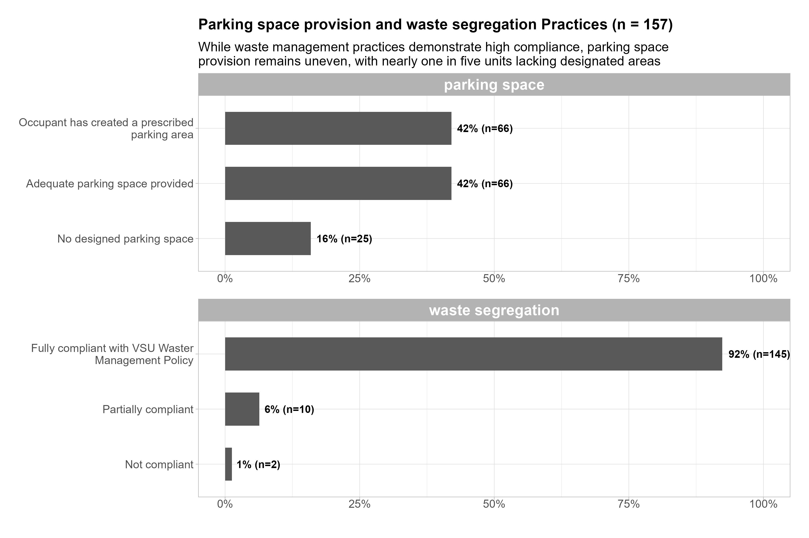
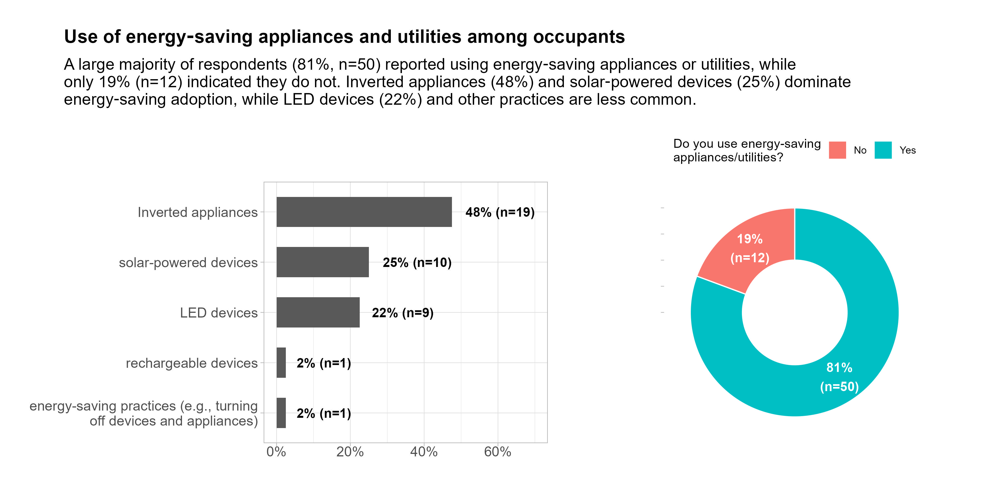

```{r}
#| echo: false
#| message: false
#| warning: false

# set working directory
setwd(here::here("vsu-housing-inventory"))

# libraries
library(tidyverse)
library(readxl)
library(janitor)
library(scales)
library(tidytext)
library(lubridate)
library(glue)
library(patchwork)


# data management source
source("data-management.R")
```

# Attachments

::: callout-note
Copies of the Figures presented in this report are available using the links below. All the files can be accessed in the Google drive folder.
:::

<ol>

<li><a href="https://drive.google.com/drive/folders/1cXbqvVzzEUuQRa3xRFILTlQoPdb7R-rd?usp=sharing" target="_blank" style="text-decoration: none">Plots</a></li>

<li><a href="https://drive.google.com/drive/folders/1Y2Qe1BuxqPUQ-cjeH4P3meKTW9dpj-ly?usp=sharing" target="_blank" style="text-decoration: none">Google Drive</a></li>

</ol>

# Facility information

### No of contracts awarded {.unnumbered}

-   Fewer contracts were awarded before 2016, usually only one or two per year. A small rise appeared in 2016 with four contracts.

-   Awards stayed low again until 2020. While from 2021 onward, contract awards increased sharply, reaching seven in 2021 and six in 2022.

-   The highest point was in 2024 with ten contracts Between 2023 and 2026, awards fluctuated between five and eight but stayed higher than earlier years.

-   Overall, contract activity was consistently greater after 2020 compared to the previous decades.

```{r}
# subtitle
subtitle_text <- str_wrap("Fewer contracts were awarded before 2016, but rose sharply after 2020, peaking in 2024 and staying high through 2026.", 80)

# deriving numbe of contracts
contract_awarded_dta <- 
    housing_dta |> 
    select(contract_date) |> 
    mutate(date = ymd(contract_date)) |> 
    select(-contract_date) |> 
    mutate(year_month = floor_date(date, "year")) |> 
    group_by(year_month) |> 
    summarise(count = n(), .groups = "drop")

# plot time series
p_contract_award <- 
    ggplot(contract_awarded_dta, aes(x = year_month, y = count)) +
    geom_line(color = "steelblue", linewidth = 1) +
    geom_point(color = "darkred", size = 2) +
    geom_text(aes(label = count), vjust = -1.3, fontface = "bold", size = 4) +
    scale_y_continuous(limits = c(0, 12), breaks = seq(0, 12, 2)) +
    scale_x_date(
    breaks = seq(as.Date("1985-01-01"), as.Date("2030-01-01"), by ="5 years"),
    labels = date_format("%Y"),
    limits = c(as.Date("1985-01-01"), as.Date("2030-01-01"))
    ) +
    labs(
    title = glue("Number of contracts awarded across the year (n = {nrow(housing_dta)})"),
    subtitle = subtitle_text,
    x = NULL,
    y = "No of contracts awarded"
    ) +
    custom_theme()

## save plot
ggsave(
    plot = p_contract_award,
    filename = "plot/contract_award.jpeg",
    units = "in",
    width = 10,
    height = 6,
    dpi = 300
)
  
# display plot

```

### Last major renovation {.unnumbered}

-   Before 2010, only isolated renovations were recorded, with counts of one or two in scattered years (1970, 2000, 2008). While a modest increase appeared in 2013 with three renovations.

-   Renovations rose sharply after 2020, beginning with six in 2022 and climbing to nine in 2023.

-   The peak occurred in 2024, with twelve renovations — the highest in the entire series.

-   In addition to these recorded events, 13 respondents reported making no major renovations at all.

```{r}
## plot subtitle
subtitle_text <- str_wrap("Fewer major renovations were recorded before 2010, but activity rose sharply after 2020, peaking in 2024 with 12 renovations; 13 respondents reported making no major renovations at all.", 80)

## number of renovation
major_renovation_dta <- 
    housing_dta |> 
    select(major_renovation) |> 
    mutate(year = str_extract_all(major_renovation, "\\d{4}")) |> 
    unnest() |> 
    count(year) |> 
    mutate(year = ymd(paste0(year, "01-01")))

# plot time series
p_major_renovation <- 
    ggplot(major_renovation_dta, aes(x = year, y = n)) +
    geom_line(color = "steelblue", linewidth = 1) +
    geom_point(color = "darkred", size = 2) +
    geom_text(aes(label = n), vjust = -1.3, fontface = "bold", size = 4) +
    scale_y_continuous(limits = c(0, 14), breaks = seq(0, 14, 2)) +
    scale_x_date(
    breaks = seq(as.Date("1970-01-01"), as.Date("2030-01-01"), by ="5 years"),
    labels = date_format("%Y"),
    limits = c(as.Date("1970-01-01"), as.Date("2030-01-01"))
    ) +
    labs(
    title = glue("Number of major renovations made across the year (n = {nrow(housing_dta)})"),
    subtitle = subtitle_text,
    x = NULL,
    y = "No of major renovations"
    ) +
    custom_theme()

## save plot
ggsave(
    plot = p_major_renovation,
    filename = "plot/major_renovation.jpeg",
    units = "in",
    width = 10,
    height = 6,
    dpi = 300
)
  
# display plot

```

### Housing materials {.unnumbered}

-   Walls: Concrete is the dominant material (about half of all wall renovations), followed by mixed half‑plywood‑half concrete. Lighter materials, plywood, and wood are used but in much smaller proportions.

-   Floors: Concrete again leads (nearly half), with tiles as the second most common choice. Wood and plywood appear occasionally, while mixed materials and kitchen‑specific flooring are rare.

-   Roofs: GI sheet overwhelmingly dominates (over 80%), with concrete and asbestos appearing only in small shares.

```{r}
#| echo: false

## plotting housing material
house_material <- 
    housing_dta |> 
    select(roof:floor) |> 
    pivot_longer(
        everything(),
        names_to = "part",
        values_to = "material"
    ) |>  
    unnest_tokens(word, material) |>  
    anti_join(stop_words) |> 
    filter(word != "sheet") |> 
    mutate(material = case_when(
        str_detect(word, "gi|sheet") ~ "GI sheet",
        str_detect(word, "half") ~ "half-plywood-half concrete",
        str_detect(word, "light|material") ~ "light material",
        str_detect(word, "floor") ~ "concrete",
        TRUE ~ word
    )) |> 
    filter(material != 'walls') |> 
    count(part, material, sort = TRUE) |> 
    filter(n > 1) |> 
    mutate(n = if_else(part == "roof" & material == "tiles", NA, n)) |> 
    na.omit() |> 
    group_by(part) |> 
    mutate(pct = n / sum(n)) |> 
    mutate(pct_lab = str_c(round(pct*100, 0), "% (n=", n, ")")) |> 
    mutate(material = reorder_within(material, pct, part))
```

```{r}

## subtitle
subtitle_text <- str_wrap("Concrete dominates both walls and floors, while GI sheet is the primary roofing material; other options such as tiles, plywood, and asbestos appear less frequently.", 80)


## plot housing material
p1_house_material <- 
    house_material |> 
    filter(part != "roof") |> 
    ggplot(aes(pct, material)) +
    geom_col(width = 0.6) +
    geom_text(aes(label = pct_lab), hjust = -0.2, fontface = "bold", size = 4) +
    scale_y_reordered() +
    facet_wrap(~ part, ncol = 1, scales = "free") +
    scale_x_continuous(labels = percent_format(), limits = c(0, 1)) +
    labs(
    title = glue("Common housing materials among housing units (n = {nrow(housing_dta)})"),
    subtitle = subtitle_text,
    x = NULL,
    y = NULL
    ) +
    custom_theme() +
    theme(
        axis.title.x = element_text(size = 16, margin = margin(b = 0)),
    )

p2_house_material <- 
    house_material |> 
    filter(part == "roof") |> 
    ggplot(aes(pct, material)) +
    geom_col(width = 0.5) +
    geom_text(aes(label = pct_lab), hjust = -0.2, fontface = "bold", size = 4) +
    scale_y_reordered() +
    facet_wrap(~ part, ncol = 1, scales = "free") +
    scale_x_continuous(labels = percent_format(), limits = c(0, 1)) +
    labs(
    title = NULL,
    subtitle = NULL,
    x = NULL,
    y = NULL
    ) +
    custom_theme() +
    theme(
        plot.margin = margin(t=0)
    )

p3_house_material <- p1_house_material / p2_house_material + plot_layout(heights = c(3, 0.7))

## save plot
ggsave(
    plot = p3_house_material,
    filename = "plot/house_material.jpeg",
    units = "in",
    width = 10,
    height = 9,
    dpi = 300
)
  
# display plot


```

# Occupancy details

### Civil status {.unnumbered}

```{r}
## subtitle
subtitle_text <- str_wrap("Most occupants are married (65%), followed by single (31%), while only a small share are widowed or separated.", 70)

## plotting civilt status
p_civil_stat <- 
    housing_dta |> 
    mutate(civil_status = if_else(str_detect(civil_status, "Single"), "Single", civil_status)) |> 
    count(civil_status) |> 
    mutate(pct = n / sum(n)) |> 
    mutate(pct_lab = str_c(round(pct*100, 0), "% (n=", n, ")")) |> 
    mutate(civil_status = fct_reorder(civil_status, pct)) |> 
    ggplot(aes(pct, civil_status)) +
    geom_col(width = 0.6) +
    geom_text(aes(label = pct_lab), hjust = -0.2, fontface = "bold", size = 4) +
    scale_x_continuous(labels = percent_format(), limits = c(0, 1)) +
    labs(
        title = glue("Civil status distribution of occupants (n = {nrow(housing_dta)})"),
        subtitle = subtitle_text,
        x = NULL,
        y = NULL
    ) +
    custom_theme()

## save plot
ggsave(
    plot = p_civil_stat,
    filename = "plot/civil_stat.jpeg",
    units = "in",
    width = 8,
    height = 3.5,
    dpi = 300
)
  
# display plot


```

### Expected retirement {.unnumbered}

-   Several pronounced spikes occur, including the highest point in 2046 (five retirees).

-   Other notable peaks are in 2050, 2052, 2054, 2055, and 2056, each with three to four retirees. This decade represents the most concentrated wave of retirements.

-   The data suggests a long stretch of low retirements followed by a concentrated cluster in the mid‑2040s to mid‑2050s.

```{r}

## subtitle
subtitle_text <- str_wrap("Expected retirements remain low and scattered in the early years, but several peaks appear between 2046 and 2056, with counts reaching up to five retirees in a single year.", 80)

## retirement date data
retirement_date_dta <- 
    housing_dta |> 
    select(retirement) |> 
    mutate(date = ymd(retirement)) |> 
    select(-retirement) |> 
    mutate(year_month = floor_date(date, "year")) |> 
    group_by(year_month) |> 
    summarise(count = n(), .groups = "drop")


# plot time series
p_retirement <- 
    ggplot(retirement_date_dta, aes(x = year_month, y = count)) +
    geom_line(color = "steelblue", linewidth = 1) +
    geom_point(color = "darkred", size = 2) +
    geom_text(aes(label = count), vjust = -1.3, fontface = "bold", size = 4) +
    scale_y_continuous(limits = c(0, 10), breaks = seq(0, 10, 2)) +
    scale_x_date(
        breaks = seq(as.Date("2024-01-01"), as.Date("2065-01-01"), by ="5 years"),
        labels = date_format("%Y"),
        limits = c(as.Date("2024-01-01"), as.Date("2065-01-01"))
    ) +
    labs(
        title = glue("Projected number of expected retirees by year (n = {nrow(housing_dta)})"),
        subtitle = subtitle_text,
        x = NULL,
        y = "No of retirees"
    ) +
    custom_theme()

## save plot
ggsave(
    plot = p_retirement,
    filename = "plot/retirement.jpeg",
    units = "in",
    width = 10,
    height = 6,
    dpi = 300
)
  
# display plot

```

### Number of co-occupants {.unnumbered}

### Number of vehicles owned {.unnumbered}

### Number of pets owned {.unnumbered}

# Conditions of facility

### Overall physical conditions {.unnumbered}

-   Around 48% (30 units) are reported as fair, indicating moderate repair needs are the most common issue. While about one‑fourth (24%, 15 units) show only minor wear and tear, suggesting a sizable portion of units remain reasonably maintained.

-   Whereas 21% (13 units) require major repairs. Only 6% (4 units) are reported as having no visible issues, underscoring that very few units are in top shape.

```{r}
## subtitle
subtitle_text <- str_wrap("Nearly half of the housing units require moderate repairs, while only a small fraction are in excellent condition.", 80)

## physical condition data
overall_physical_cond_dta <- 
    housing_dta |> 
    count(house_physical_condition) |> 
    mutate(pct = n / sum(n)) |> 
    mutate(pct_lab = str_c(round(pct*100, 0), "% (n=", n, ")")) |> 
    mutate(house_physical_condition = fct_reorder(house_physical_condition, pct))


## plotting physical condition
p_unit_physical_condition <- 
    overall_physical_cond_dta |> 
    ggplot(aes(pct, house_physical_condition)) +
    geom_col(width = 0.6) +
    geom_text(aes(label = pct_lab), hjust = -0.2, fontface = "bold", size = 4) +
    scale_x_continuous(labels = percent_format(), limits = c(0, 1)) +
    labs(
        title = glue("Reported overall physical condition of the unit (n = {nrow(housing_dta)})"),
        subtitle = subtitle_text,
        x = NULL,
        y = NULL
    ) +
    custom_theme()

## save plot
ggsave(
    plot = p_unit_physical_condition,
    filename = "plot/unit_physical_condition.jpeg",
    units = "in",
    width = 10,
    height = 4,
    dpi = 300
)
  
# display plot


```

### Structural issues observed {.unnumbered}

-   Roof leaks/damage is the leading concern, reported by 40 occupants (27%). Plumbing problems and wall cracks/damage follow closely, each affecting around 17% of respondents.

-   Flooring issues (14%) and electrical problems (11%) represent other notable maintenance challenges.Less common but still present are termite/rat infestations (5%), toilet/bathroom issues (3%), and ceiling cracks/damage (3%).

-   No issues were reported by only 6 respondents (4%), showing that the vast majority of the housing occupants experienced at least one problem.

```{r}

## subtitle text
subtitle_text <- str_wrap("Roof leaks and structural problems are the most frequently reported, while infestations and bathroom issues are less common; only a few respondents reported no issues at all.", 80)


## housing issues data
issues_dta <- 
    housing_dta |> 
    select(structural_issues) |> 
    mutate(issues = str_split(structural_issues, ",|;")) |> 
    unnest(cols = c(issues)) |> 
    mutate(issues = str_trim(issues)) |> 
    mutate(issues = case_when(
        str_detect(issues, "CR|Bathroom|BR|Toilet|toilet") ~ "Toilet and bathroom issues",
        str_detect(issues, "Termite|termites|rat|termite|anay") ~ "Termites and rat infestation",
        str_detect(issues, "Ceiling|ceiling|Ceilings") ~ "Ceiling cracks/damage",
        str_detect(issues, "roof") ~ "Roof leaks/damage",
        str_detect(issues, "floor|flooring") ~ "Flooring issues",
        TRUE ~ issues
    )) |> 
    count(issues, sort = TRUE) |> 
    filter(n>1) |> 
    mutate(pct = n / sum(n)) |> 
    mutate(pct_lab = str_c(round(pct*100, 0), "% (n=", n, ")")) |> 
    mutate(issues = fct_reorder(issues, pct))

## plotting observed issues
p_housing_issues <- 
    issues_dta |> 
    ggplot(aes(pct, issues)) +
    geom_col(width = 0.6) +
    geom_text(aes(label = pct_lab), hjust = -0.2, fontface = "bold", size = 4) +
    scale_x_continuous(labels = percent_format(), limits = c(0, 0.5)) +
    labs(
        title = glue("Reported issues observed by occupants (n = {nrow(housing_dta)})"),
        subtitle = subtitle_text,
        x = NULL,
        y = NULL
    ) +
    custom_theme()

## save plot
ggsave(
    plot = p_housing_issues,
    filename = "plot/housing_issues.jpeg",
    units = "in",
    width = 10,
    height = 6,
    dpi = 300
)
  
# display plot

    
```

### Prescribed fire extinguishers and other safey equipment {.unnumbered}

```{r}

## subtitle text
subtitle_text <- str_wrap("Most units do not have prescribed fire extinguishers or other safety equipment, leaving a critical gap in emergency preparedness.", 70 )

## safety quipment data
safety_equip_dta <- 
    housing_dta |> 
    select(safety_equipment) |> 
    count(safety_equipment) |> 
    mutate(
    pct = n / sum(n),
    label = paste0(safety_equipment, "\n", scales::percent(pct))
  )

## plotting data
p_safety_equipment <- 
    safety_equip_dta |> 
    ggplot(aes(x = 2, y = pct, fill = safety_equipment)) +
    geom_col(width = 1, color = "white", show.legend = F) +
    coord_polar(theta = "y") +
    xlim(0.5, 2.5) +
    geom_text(aes(label = label), 
            position = position_stack(vjust = 0.5), 
            color = "white", size = 5, fontface = "bold") +
    labs(
        title = "Availability of prescribed safety equipment in housing units",
        subtitle = subtitle_text,
        fill = "Response",
        x = NULL,
        y = NULL
    ) +
    custom_theme() +
    theme(
        plot.margin = margin(20, 20, 20, -20),
        plot.title.position = "plot",
        panel.grid = element_blank(),
        panel.border = element_blank(),
        axis.text = element_text(color = "white")
    )

## save plot
ggsave(
    plot = p_safety_equipment,
    filename = "plot/safety_equipment.jpeg",
    units = "in",
    width = 8,
    height = 6,
    dpi = 300
)
  
# display plot

```

### Parking space and waste segretation compliance {.unnumbered}

-   Around 44% (27 units) created a prescribed parking area while 39% (24 units) have adequate parking space provided.

-   On the other hand, 18% (11 units) report no designed parking space, indicating gaps in infrastructure planning.

-   While 90% (56 units) are fully compliant with the VSU Waste Management Policy. Only 10% (6 units) are partially compliant, showing room for improvement but overall high adherence.

```{r}
## subtitle text
subtitle_text <- str_wrap("While waste management practices demonstrate high compliance, parking space provision remains uneven, with nearly one in five units lacking designated areas", 80)

## parking space and waste management compliance data
compliance_dta <- 
    housing_dta |>
    select(starts_with("compliance")) |> 
    pivot_longer(
        cols = everything(),
        names_to = "area",
        values_to = "compliance") |> 
    mutate(area = str_replace_all(area, "_", " ")) |> 
    mutate(area = str_remove(area, "compliance")) |> 
    mutate(area = str_trim(area)) |> 
    count(area, compliance) |> 
    group_by(area) |> 
    mutate(pct = n / sum(n)) |> 
    mutate(pct_lab = str_c(round(pct*100, 0), "% (n=", n, ")")) |> 
    ungroup() |> 
    mutate(compliance = str_wrap(compliance, 40)) |> 
    mutate(compliance = fct_reorder(compliance, pct))


## plotting data
p_compliance_parking_waste <- 
    compliance_dta |> 
    ggplot(aes(pct, compliance)) +
    geom_col(width = 0.6) +
    geom_text(aes(label = pct_lab), hjust = -0.1, fontface = "bold", size = 4) +
    scale_y_reordered() +
    facet_wrap(~ area, ncol = 1, scales = "free") +
    scale_x_continuous(labels = percent_format(), limits = c(0, 1)) +
    labs(
    title = glue("Parking space provision and waste segregation Practices (n = {nrow(housing_dta)})"),
    subtitle = subtitle_text,
    x = NULL,
    y = NULL
    ) +
    custom_theme() +
    theme(
        axis.title.x = element_text(size = 16, margin = margin(b = 0)),
    )

## save plot
ggsave(
    plot = p_compliance_parking_waste,
    filename = "plot/compliance_parking_waste.jpeg",
    units = "in",
    width = 12,
    height = 8,
    dpi = 300
)
  
# display plot

```


### Energy saving {.unnumbered}

- A large majority of respondents (81%, n=50) reported using energy‑saving appliances or utilities. About one in five respondents (19%, n=12) do not use energy‑saving appliances/utilities.

- Among those who use energy‑saving options, inverted appliances are the most frequently reported (48%, n=19). Solar‑powered devices (25%, n=10) and LED devices (22%, n=9) show notable adoption.

- While only 2% (n=1 each) reported using rechargeable devices or simple energy‑saving practices (like turning off appliances).

```{r}

## caption text
caption_text <- str_wrap("A large majority of respondents (81%, n=50) reported using energy‑saving appliances or utilities, while only 19% (n=12) indicated they do not. Inverted appliances (48%) and solar‑powered devices (25%) dominate energy‑saving adoption, while LED devices (22%) and other practices are less common.", 110)

## energy saving data
energy_saving_dta <- 
    housing_dta |> 
    count(energy_saving) |> 
    n_pct() |> 
    mutate(pct_lab = str_wrap(pct_lab, 2))

## plotting energy saving data
p1_energy_saving <- 
    energy_saving_dta |> 
    ggplot(aes(x = 2, y = pct, fill = energy_saving)) +
    geom_col(width = 1, color = "white", show.legend = T) +
    coord_polar(theta = "y") +
    xlim(0.5, 2.5) +
    geom_text(aes(label = pct_lab), 
            position = position_stack(vjust = 0.5), 
            color = "white", size = 4, fontface = "bold") +
    labs(
        title = NULL,
        fill = "Do you use energy-saving\nappliances/utilities?",
        y = NULL,
        x = NULL
    ) +
    custom_theme() +
    theme(
        plot.margin = margin(0, 0, 0, 0),
        plot.title.position = "plot",
        plot.caption.position = "plot",
        panel.grid = element_blank(),
        panel.border = element_blank(),
        axis.text = element_text(color = "white"),
        axis.title.y = element_text(face = "bold"),
        legend.position = "top"
    )


## energy saving devices list
energy_saving_devices_dta <- 
    housing_dta |> 
    select(energy_saving_list) |>
    mutate(energy_saving_list = str_to_lower(energy_saving_list)) |> 
    mutate(energy_saving = case_when(
        str_detect(energy_saving_list, "inverter|inverted") ~ "Inverted appliances",
        str_detect(energy_saving_list, "led") ~ "LED devices",
        str_detect(energy_saving_list, "solar") ~ "solar-powered devices",
        str_detect(energy_saving_list, "recharge") ~ "rechargeable devices",
        str_detect(energy_saving_list, "only during") ~ "energy-saving practices (e.g., turning off devices and appliances)"
    )) |> 
    na.omit() |> 
    count(energy_saving) |> 
    n_pct() |> 
    mutate(energy_saving = str_wrap(energy_saving, 40)) |> 
    mutate(energy_saving = fct_reorder(energy_saving, pct))

## plot energy saving devices
p2_energy_saving_devices <- 
    energy_saving_devices_dta |> 
    ggplot(aes(pct, energy_saving)) +
    geom_col(width = 0.6) +
    geom_text(aes(label = pct_lab), hjust = -0.2, fontface = "bold", size = 4) +
    scale_x_continuous(labels = percent_format(), limits = c(0, 0.70)) +
    labs(
        title = glue("Use of energy‑saving appliances and utilities among occupants"),
        subtitle = caption_text,,
        y = NULL,
        x = NULL
    ) +
    custom_theme() +
    theme(
        plot.title = element_text(hjust = 0, margin = margin(l = 30, b = 10)),
        plot.title.position = "plot",
        plot.subtitle = element_text(margin = margin(l = 30, b=20)),
        margin = margin(l=0, t=10)
    )


p_energy_saving <- p2_energy_saving_devices + p1_energy_saving + plot_layout(width = c(1, 1.4))

## save plot
ggsave(
    plot = p_energy_saving,
    filename = "plot/energy_saving.jpeg",
    units = "in",
    width = 12,
    height = 6,
    dpi = 300
)
  
# display plot


```