```{r}
#| echo: false
#| message: false
#| warning: false

# set working directory
setwd(here::here("vsu-housing-inventory"))

# libraries
library(tidyverse)
library(readxl)
library(janitor)
library(scales)
library(tidytext)
library(lubridate)
library(glue)
library(patchwork)


# data management source
source("data-management.R")
```

# Attachments

::: callout-note
Copies of the Figures presented in this report are available using the links below. All the files can be accessed in the Google drive folder.
:::

<ol>

<li><a href="https://drive.google.com/drive/folders/1JHupOti9FjbufVhpFL9X3b-D0SWHVzWt?usp=sharing" target="_blank" style="text-decoration: none">Plots</a></li>

<li><a href="" target="_blank" style="text-decoration: none">Google Drive</a></li>

</ol>

# Facility information

### No of contracts awarded {.unnumbered}

-   Contract awards were minimal, usually only one to three per year, with a small rise in 2016

-   Awards remained low until 2020, then surged dramatically, reaching 17 in 2021 and 31 in 2022.

-   The highest number of awards occurred in 2024 with 33 contracts. Between 2023 and 2026, awards fluctuated (23 in 2023, 33 in 2024, 4 in 2025, and 8 in 2026) but stayed higher than pre‑2020 levels.

-   Contract activity was consistently greater after 2020 compared to the previous decades.

```{r}
# subtitle
subtitle_text <- str_wrap("Fewer contracts were awarded before 2016, but rose sharply after 2020, peaking in 2024 and staying high through 2026.", 80)

# deriving numbe of contracts
contract_awarded_dta <- 
    housing_dta |> 
    select(contract_date) |> 
    na.omit() |> 
    mutate(date = ymd(contract_date)) |> 
    select(-contract_date) |> 
    mutate(year_month = floor_date(date, "year")) |> 
    group_by(year_month) |> 
    summarise(count = n(), .groups = "drop")

# plot time series
p_contract_award <- 
    ggplot(contract_awarded_dta, aes(x = year_month, y = count)) +
    geom_line(color = "steelblue", linewidth = 1) +
    geom_point(color = "darkred", size = 2) +
    geom_text(aes(label = count), vjust = -1.3, fontface = "bold", size = 4) +
    scale_y_continuous(limits = c(0, 40), breaks = seq(0, 40, 5)) +
    scale_x_date(
    breaks = seq(as.Date("1985-01-01"), as.Date("2030-01-01"), by ="5 years"),
    labels = date_format("%Y"),
    limits = c(as.Date("1985-01-01"), as.Date("2030-01-01"))
    ) +
    labs(
    title = glue("Number of contracts awarded across the year (n = {nrow(housing_dta)})"),
    subtitle = subtitle_text,
    x = NULL,
    y = "No of contracts awarded"
    ) +
    custom_theme()

## save plot
ggsave(
    plot = p_contract_award,
    filename = "plot/contract_award.jpeg",
    units = "in",
    width = 10,
    height = 6,
    dpi = 300
)
  
# display plot
knitr::include_graphics("plot/contract_award.jpeg")
```


### Last major renovation {.unnumbered}

- Renovations were isolated, usually only one per year (1970, 2000, 2005–2007), with a modest spike in 2008 (four).

- Renovations increased slightly, with notable counts in 2013 (six) and 2014 (three), but overall remained modest.

- Renovations rose dramatically, reaching 20 in 2022, 18 in 2023, and 13 in 2024.

- Renovations climbed again to 20, before dropping to 8 in 2026.

- Renovation activity was consistently greater after 2020 compared to earlier decades, marking a clear shift in housing maintenance practices.

- Five respondents reported making no major renovations at all.

```{r}
## plot subtitle
subtitle_text <- str_wrap("Major renovations were low before 2010, with only isolated cases (mostly one per year). Activity gradually increased between 2010 and 2020, then surged sharply after 2021. Renovations peaked at 20 in both 2022 and 2025, with a notable high of 18 in 2023 and 13 in 2024. In addition, 5 respondents reported no major renovations at all.", 90)

## number of renovation
major_renovation_dta <- 
    housing_dta |> 
    select(major_renovation) |> 
    mutate(year = str_extract_all(major_renovation, "\\d{4}")) |> 
    unnest() |> 
    count(year) |> 
    mutate(year = ymd(paste0(year, "01-01")))

# plot time series
p_major_renovation <- 
    ggplot(major_renovation_dta, aes(x = year, y = n)) +
    geom_line(color = "steelblue", linewidth = 1) +
    geom_point(color = "darkred", size = 2) +
    geom_text(aes(label = n), vjust = -1.3, fontface = "bold", size = 4) +
    scale_y_continuous(limits = c(0, 30), breaks = seq(0, 30, 5)) +
    scale_x_date(
    breaks = seq(as.Date("1970-01-01"), as.Date("2030-01-01"), by ="5 years"),
    labels = date_format("%Y"),
    limits = c(as.Date("1970-01-01"), as.Date("2030-01-01"))
    ) +
    labs(
    title = glue("Number of major renovations made across the year (n = {nrow(housing_dta)})"),
    subtitle = subtitle_text,
    x = NULL,
    y = "No of major renovations"
    ) +
    custom_theme()

## save plot
ggsave(
    plot = p_major_renovation,
    filename = "plot/major_renovation.jpeg",
    units = "in",
    width = 10,
    height = 6,
    dpi = 300
)
  
# display plot
knitr::include_graphics("plot/major_renovation.jpeg")
```

### Housing materials {.unnumbered}

-   Walls: Concrete is the dominant material (about half of all wall renovations), followed by mixed half‑plywood‑half concrete. Lighter materials, plywood, and wood are used but in much smaller proportions.

-   Floors: Concrete again leads (nearly half), with tiles as the second most common choice. Wood and plywood appear occasionally, while mixed materials and kitchen‑specific flooring are rare.

-   Roofs: GI sheet overwhelmingly dominates (over 80%), with concrete and asbestos appearing only in small shares.

```{r}
#| echo: false

## plotting housing material
house_material <- 
    housing_dta |> 
    select(roof:floor) |> 
    pivot_longer(
        everything(),
        names_to = "part",
        values_to = "material"
    ) |>  
    unnest_tokens(word, material) |>  
    anti_join(stop_words) |> 
    filter(word != "sheet") |> 
    mutate(material = case_when(
        str_detect(word, "gi|sheet") ~ "GI sheet",
        str_detect(word, "half") ~ "half-plywood-half concrete",
        str_detect(word, "light|material") ~ "light material",
        str_detect(word, "floor") ~ "concrete",
        TRUE ~ word
    )) |> 
    filter(material != 'walls') |> 
    filter(!str_detect(material, "3|2|1")) |> 
    count(part, material, sort = TRUE) |> 
    filter(n > 1) |> 
    mutate(n = if_else(part == "roof" & material == "tiles", NA, n)) |> 
    na.omit() |> 
    group_by(part) |> 
    mutate(pct = n / sum(n)) |> 
    mutate(pct_lab = str_c(round(pct*100, 0), "% (n=", n, ")")) |> 
    mutate(material = reorder_within(material, pct, part))
```

```{r}

## subtitle
subtitle_text <- str_wrap("Concrete dominates both walls and floors, while GI sheet is the primary roofing material; other options such as tiles, plywood, and asbestos appear less frequently.", 80)


## plot housing material
p1_house_material <- 
    house_material |> 
    filter(part != "roof") |> 
    ggplot(aes(pct, material)) +
    geom_col(width = 0.6) +
    geom_text(aes(label = pct_lab), hjust = -0.2, fontface = "bold", size = 4) +
    scale_y_reordered() +
    facet_wrap(~ part, ncol = 1, scales = "free") +
    scale_x_continuous(labels = percent_format(), limits = c(0, 1)) +
    labs(
    title = glue("Common housing materials among housing units (n = {nrow(housing_dta)})"),
    subtitle = subtitle_text,
    x = NULL,
    y = NULL
    ) +
    custom_theme() +
    theme(
        axis.title.x = element_text(size = 16, margin = margin(b = 0)),
    )

p2_house_material <- 
    house_material |> 
    filter(part == "roof") |> 
    ggplot(aes(pct, material)) +
    geom_col(width = 0.5) +
    geom_text(aes(label = pct_lab), hjust = -0.2, fontface = "bold", size = 4) +
    scale_y_reordered() +
    facet_wrap(~ part, ncol = 1, scales = "free") +
    scale_x_continuous(labels = percent_format(), limits = c(0, 1)) +
    labs(
    title = NULL,
    subtitle = NULL,
    x = NULL,
    y = NULL
    ) +
    custom_theme() +
    theme(
        plot.margin = margin(t=0)
    )

p3_house_material <- p1_house_material / p2_house_material + plot_layout(heights = c(3, 0.7))

## save plot
ggsave(
    plot = p3_house_material,
    filename = "plot/house_material.jpeg",
    units = "in",
    width = 10,
    height = 9,
    dpi = 300
)
  
# display plot
knitr::include_graphics("plot/house_material.jpeg")

```

# Occupancy details

### Civil status {.unnumbered}

```{r}
## subtitle
subtitle_text <- str_wrap("Most occupants are married (73%), followed by single (22%), while only a small share are widowed or separated.", 70)

## plotting civilt status
p_civil_stat <- 
    housing_dta |> 
    mutate(civil_status = if_else(str_detect(civil_status, "Single"), "Single", civil_status)) |> 
    mutate(civil_status = str_to_sentence(civil_status)) |> 
    count(civil_status) |> 
    mutate(pct = n / sum(n)) |> 
    mutate(pct_lab = str_c(round(pct*100, 0), "% (n=", n, ")")) |> 
    mutate(civil_status = fct_reorder(civil_status, pct)) |> 
    ggplot(aes(pct, civil_status)) +
    geom_col(width = 0.6) +
    geom_text(aes(label = pct_lab), hjust = -0.2, fontface = "bold", size = 4) +
    scale_x_continuous(labels = percent_format(), limits = c(0, 1)) +
    labs(
        title = glue("Civil status distribution of occupants (n = {nrow(housing_dta)})"),
        subtitle = subtitle_text,
        x = NULL,
        y = NULL
    ) +
    custom_theme()

## save plot
ggsave(
    plot = p_civil_stat,
    filename = "plot/civil_stat.jpeg",
    units = "in",
    width = 8,
    height = 3.5,
    dpi = 300
)
  
# display plot
knitr::include_graphics("plot/civil_stat.jpeg")

```

### Expected retirement {.unnumbered}

- The data suggests a long stretch of scattered retirements followed by concentrated waves in the mid‑2030s and again in the mid‑2040s to mid‑2050s

- Expected retirements are scattered from 2024 through the early 2030s, with only modest peaks (e.g., 6 in 2026, 5 in 2028 and 2030). While a pronounced spike occurs in 2036 with 11 retirees, marking the first significant wave.

- Several concentrated peaks appear, including 10 in 2046, 7 in 2054, and 9 in 2056. This period represents the most consistent cluster of retirements.

```{r}

## subtitle
subtitle_text <- str_wrap("Expected retirements from 2026 onward, show several peaks: 11 retirees in 2036, 10 in 2046, and 9 in 2056. Other notable highs include 6 in 2026, 20 in 2022, and 7 in 2054.", 80)

## retirement date data
retirement_date_dta <- 
    housing_dta |> 
    select(retirement) |> 
    mutate(date = ymd(retirement)) |> 
    select(-retirement) |> 
    mutate(year_month = floor_date(date, "year")) |> 
    group_by(year_month) |> 
    summarise(count = n(), .groups = "drop")


# plot time series
p_retirement <- 
    ggplot(retirement_date_dta, aes(x = year_month, y = count)) +
    geom_line(color = "steelblue", linewidth = 1) +
    geom_point(color = "darkred", size = 2) +
    geom_text(aes(label = count), vjust = -1.3, fontface = "bold", size = 4) +
    scale_y_continuous(limits = c(0, 20), breaks = seq(0, 20, 5)) +
    scale_x_date(
        breaks = seq(as.Date("2024-01-01"), as.Date("2065-01-01"), by ="5 years"),
        labels = date_format("%Y"),
        limits = c(as.Date("2024-01-01"), as.Date("2065-01-01"))
    ) +
    labs(
        title = glue("Projected number of expected retirees by year (n = {nrow(housing_dta)})"),
        subtitle = subtitle_text,
        x = NULL,
        y = "No of retirees"
    ) +
    custom_theme()

## save plot
ggsave(
    plot = p_retirement,
    filename = "plot/retirement.jpeg",
    units = "in",
    width = 10,
    height = 6,
    dpi = 300
)
  
# display plot
knitr::include_graphics("plot/retirement.jpeg")
```

### Number of co-occupants {.unnumbered}

### Number of vehicles owned {.unnumbered}

### Number of pets owned {.unnumbered}

# Conditions of facility

### Overall physical conditions {.unnumbered}

- The largest share of units (43%, n=67) are rated Fair, indicating moderate repairs are the most common issue. About one‑third (31%, n=49) are in Good condition, showing only minor wear and tear.

- Whereas, 16% (n=25) are in Poor condition, requiring major repairs. Only 10% (n=16) are rated Excellent, underscoring that very few units are free of visible issues.

```{r}
## subtitle
subtitle_text <- str_wrap("Nearly half of the housing units require moderate repairs, while only a small fraction are in excellent condition.", 80)

## physical condition data
overall_physical_cond_dta <- 
    housing_dta |> 
    count(house_physical_condition) |> 
    mutate(pct = n / sum(n)) |> 
    mutate(pct_lab = str_c(round(pct*100, 0), "% (n=", n, ")")) |> 
    mutate(house_physical_condition = fct_reorder(house_physical_condition, pct))


## plotting physical condition
p_unit_physical_condition <- 
    overall_physical_cond_dta |> 
    ggplot(aes(pct, house_physical_condition)) +
    geom_col(width = 0.6) +
    geom_text(aes(label = pct_lab), hjust = -0.2, fontface = "bold", size = 4) +
    scale_x_continuous(labels = percent_format(), limits = c(0, 1)) +
    labs(
        title = glue("Reported overall physical condition of the unit (n = {nrow(housing_dta)})"),
        subtitle = subtitle_text,
        x = NULL,
        y = NULL
    ) +
    custom_theme()

## save plot
ggsave(
    plot = p_unit_physical_condition,
    filename = "plot/unit_physical_condition.jpeg",
    units = "in",
    width = 10,
    height = 4,
    dpi = 300
)
  
# display plot
knitr::include_graphics("plot/unit_physical_condition.jpeg")

```

### Structural issues observed {.unnumbered}

- Roof leaks or damage are the most common issue, reported by 28% (n=98) of respondents.

- Wall cracks/damage affect 20% (n=70), while plumbing problems (15%, n=54) and flooring issues (15%, n=52) are also significant. 
- Electrical problems are reported by 11% (n=38). Less common but still present are termite/rat infestations (3%, n=10), ceiling cracks (1%, n=5), and toilet/bathroom issues (1%, n=5).

- Only 5% (n=18) of respondents reported no problems, highlighting that the vast majority of housing units experience at least one maintenance concern.

```{r}

## subtitle text
subtitle_text <- str_wrap("Roof leaks and structural problems are the most frequently reported, while infestations and bathroom issues are less common; only a few respondents reported no issues at all.", 80)


## housing issues data
issues_dta <- 
    housing_dta |> 
    select(structural_issues) |> 
    mutate(issues = str_split(structural_issues, ",|;")) |> 
    unnest(cols = c(issues)) |> 
    mutate(issues = str_trim(issues)) |> 
    mutate(issues = case_when(
        str_detect(issues, "CR|Bathroom|BR|Toilet|toilet") ~ "Toilet and bathroom issues",
        str_detect(issues, "Termite|termites|rat|termite|anay") ~ "Termites and rat infestation",
        str_detect(issues, "Ceiling|ceiling|Ceilings") ~ "Ceiling cracks/damage",
        str_detect(issues, "roof") ~ "Roof leaks/damage",
        str_detect(issues, "floor|flooring") ~ "Flooring issues",
        TRUE ~ issues
    )) |> 
    count(issues, sort = TRUE) |> 
    filter(n>1) |> 
    mutate(pct = n / sum(n)) |> 
    mutate(pct_lab = str_c(round(pct*100, 0), "% (n=", n, ")")) |> 
    mutate(issues = fct_reorder(issues, pct))

## plotting observed issues
p_housing_issues <- 
    issues_dta |> 
    ggplot(aes(pct, issues)) +
    geom_col(width = 0.6) +
    geom_text(aes(label = pct_lab), hjust = -0.2, fontface = "bold", size = 4) +
    scale_x_continuous(labels = percent_format(), limits = c(0, 0.5)) +
    labs(
        title = glue("Reported issues observed by occupants (n = {nrow(housing_dta)})"),
        subtitle = subtitle_text,
        x = NULL,
        y = NULL
    ) +
    custom_theme()

## save plot
ggsave(
    plot = p_housing_issues,
    filename = "plot/housing_issues.jpeg",
    units = "in",
    width = 10,
    height = 6,
    dpi = 300
)
  
# display plot
knitr::include_graphics("plot/housing_issues.jpeg")
    
```

### Prescribed fire extinguishers and other safey equipment {.unnumbered}

- A large majority of housing units (85%) lack prescribed safety equipment such as fire extinguishers, leaving them vulnerable in emergencies.

- Only 15% of units reported having the required safety equipment, showing very limited adherence to safety standards.

```{r}

## subtitle text
subtitle_text <- str_wrap("Most units do not have prescribed fire extinguishers or other safety equipment, leaving a critical gap in emergency preparedness.", 70 )

## safety quipment data
safety_equip_dta <- 
    housing_dta |> 
    select(safety_equipment) |> 
    count(safety_equipment) |> 
    mutate(
    pct = n / sum(n),
    label = paste0(safety_equipment, "\n", scales::percent(pct))
  )

## plotting data
p_safety_equipment <- 
    safety_equip_dta |> 
    ggplot(aes(x = 2, y = pct, fill = safety_equipment)) +
    geom_col(width = 1, color = "white", show.legend = F) +
    coord_polar(theta = "y") +
    xlim(0.5, 2.5) +
    geom_text(aes(label = label), 
            position = position_stack(vjust = 0.5), 
            color = "white", size = 5, fontface = "bold") +
    labs(
        title = "Availability of prescribed safety equipment in housing units",
        subtitle = subtitle_text,
        fill = "Response",
        x = NULL,
        y = NULL
    ) +
    custom_theme() +
    theme(
        plot.margin = margin(20, 20, 20, -20),
        plot.title.position = "plot",
        panel.grid = element_blank(),
        panel.border = element_blank(),
        axis.text = element_text(color = "white")
    )

## save plot
ggsave(
    plot = p_safety_equipment,
    filename = "plot/safety_equipment.jpeg",
    units = "in",
    width = 8,
    height = 6,
    dpi = 300
)
  
# display plot
knitr::include_graphics("plot/safety_equipment.jpeg")
```

### Parking space and waste segretation compliance {.unnumbered}

- Parking space provision remains uneven, with 42% (n=66) reporting adequate space and another 42% (n=66) creating their own prescribed parking areas, while 16% (n=25) have no designated space. 

- In contrast, waste segregation shows strong compliance: 92% (n=145) are fully compliant with the VSU Waste Management Policy, 6% (n=10) partially compliant, and only 1% (n=2) not compliant.


```{r}
## subtitle text
subtitle_text <- str_wrap("While waste management practices demonstrate high compliance, parking space provision remains uneven, with nearly one in five units lacking designated areas", 80)

## parking space and waste management compliance data
compliance_dta <- 
    housing_dta |>
    select(starts_with("compliance")) |> 
    pivot_longer(
        cols = everything(),
        names_to = "area",
        values_to = "compliance") |> 
    mutate(area = str_replace_all(area, "_", " ")) |> 
    mutate(area = str_remove(area, "compliance")) |> 
    mutate(area = str_trim(area)) |> 
    count(area, compliance) |> 
    group_by(area) |> 
    mutate(pct = n / sum(n)) |> 
    mutate(pct_lab = str_c(round(pct*100, 0), "% (n=", n, ")")) |> 
    ungroup() |> 
    mutate(compliance = str_wrap(compliance, 40)) |> 
    mutate(compliance = fct_reorder(compliance, pct))


## plotting data
p_compliance_parking_waste <- 
    compliance_dta |> 
    ggplot(aes(pct, compliance)) +
    geom_col(width = 0.6) +
    geom_text(aes(label = pct_lab), hjust = -0.1, fontface = "bold", size = 4) +
    scale_y_reordered() +
    facet_wrap(~ area, ncol = 1, scales = "free") +
    scale_x_continuous(labels = percent_format(), limits = c(0, 1)) +
    labs(
    title = glue("Parking space provision and waste segregation Practices (n = {nrow(housing_dta)})"),
    subtitle = subtitle_text,
    x = NULL,
    y = NULL
    ) +
    custom_theme() +
    theme(
        axis.title.x = element_text(size = 16, margin = margin(b = 0)),
    )

## save plot
ggsave(
    plot = p_compliance_parking_waste,
    filename = "plot/compliance_parking_waste.jpeg",
    units = "in",
    width = 12,
    height = 8,
    dpi = 300
)
  
# display plot
knitr::include_graphics("plot/compliance_parking_waste.jpeg")
```

### Energy saving {.unnumbered}

- A large majority of respondents (76%, n=119) reported using energy‑saving appliances or utilities, while 24% (n=38) do not.

- Among those adopting energy‑saving options, inverted appliances are the most frequently reported (54%, n=49).

- Solar‑powered devices (29%, n=26) and LED devices (16%, n=14) show significant uptake.

- Only 1% (n=1) reported depending mainly on simple energy‑saving practices such as turning off appliances.

```{r}

## caption text
caption_text <- str_wrap("A large majority of respondents reported using energy-saving appliances or utilities, while 24% indicated they do not. Among those adopting energy-saving measures, inverted appliances are the most common, followed by solar-powered devices and LED devices.", 110)

## energy saving data
energy_saving_dta <- 
    housing_dta |> 
    count(energy_saving) |> 
    n_pct() |> 
    mutate(pct_lab = str_wrap(pct_lab, 2))

## plotting energy saving data
p1_energy_saving <- 
    energy_saving_dta |> 
    ggplot(aes(x = 2, y = pct, fill = energy_saving)) +
    geom_col(width = 1, color = "white", show.legend = T) +
    coord_polar(theta = "y") +
    xlim(0.5, 2.5) +
    geom_text(aes(label = pct_lab), 
            position = position_stack(vjust = 0.5), 
            color = "white", size = 4, fontface = "bold") +
    labs(
        title = NULL,
        fill = "Do you use energy-saving\nappliances/utilities?",
        y = NULL,
        x = NULL
    ) +
    custom_theme() +
    theme(
        plot.margin = margin(0, 0, 0, 0),
        plot.title.position = "plot",
        plot.caption.position = "plot",
        panel.grid = element_blank(),
        panel.border = element_blank(),
        axis.text = element_text(color = "white"),
        axis.title.y = element_text(face = "bold"),
        legend.position = "top"
    )


## energy saving devices list
energy_saving_devices_dta <- 
    housing_dta |> 
    select(energy_saving_list) |>
    mutate(energy_saving_list = str_to_lower(energy_saving_list)) |> 
    mutate(energy_saving = case_when(
        str_detect(energy_saving_list, "inverter|inverted") ~ "Inverted appliances",
        str_detect(energy_saving_list, "led") ~ "LED devices",
        str_detect(energy_saving_list, "solar") ~ "solar-powered devices",
        str_detect(energy_saving_list, "recharge") ~ "rechargeable devices",
        str_detect(energy_saving_list, "only during") ~ "energy-saving practices (e.g., turning off devices and appliances)"
    )) |> 
    na.omit() |> 
    count(energy_saving) |> 
    n_pct() |> 
    mutate(energy_saving = str_wrap(energy_saving, 40)) |> 
    mutate(energy_saving = fct_reorder(energy_saving, pct))

## plot energy saving devices
p2_energy_saving_devices <- 
    energy_saving_devices_dta |> 
    ggplot(aes(pct, energy_saving)) +
    geom_col(width = 0.6) +
    geom_text(aes(label = pct_lab), hjust = -0.2, fontface = "bold", size = 4) +
    scale_x_continuous(labels = percent_format(), limits = c(0, 0.70)) +
    labs(
        title = glue("Use of energy‑saving appliances and utilities among occupants"),
        subtitle = caption_text,,
        y = NULL,
        x = NULL
    ) +
    custom_theme() +
    theme(
        plot.title = element_text(hjust = 0, margin = margin(l = 30, b = 10)),
        plot.title.position = "plot",
        plot.subtitle = element_text(margin = margin(l = 30, b=20)),
        margin = margin(l=0, t=10)
    )


p_energy_saving <- p2_energy_saving_devices + p1_energy_saving + plot_layout(width = c(1, 1.4))

## save plot
ggsave(
    plot = p_energy_saving,
    filename = "plot/energy_saving.jpeg",
    units = "in",
    width = 12,
    height = 6,
    dpi = 300
)
  
# display plot
knitr::include_graphics("plot/energy_saving.jpeg")

```

### Lease renewal {.unnumbered}

-   The vast majority of units (94%, n=148) have current and valid leases, showing that lease renewal requirements are generally well‑observed.

-   A small portion (3%, n=4) have expired leases but are already in the process of renewal.

-   Only 3% (n=5) of units have expired leases with no renewal, highlighting very limited non‑compliance.

```{r}
## caption
subtitle_text <- str_wrap("Most leases remain current and valid, with only a small share either expired but under renewal or expired without renewal", 75)

## lease data
lease_dta <- 
    housing_dta |> 
    select(lease_renewal) |> 
    count(lease_renewal, sort = TRUE) |> 
    n_pct()

## plotting lease data
p_lease_renewal <- 
    lease_dta |> 
    ggplot(aes(pct, lease_renewal)) +
    geom_col(width = 0.6) +
    geom_text(aes(label = pct_lab), hjust = -0.1, fontface = "bold", size = 4) +
    scale_x_continuous(labels = percent_format(), limits = c(0, 1.2), breaks = seq(0, 1, 0.25)) +
    coord_cartesian(expand = TRUE, clip = "off") +
    labs(
        title = glue("Status of lease renewal (n = {nrow(housing_dta)})"),
        subtitle = subtitle_text,
        x = NULL,
        y = NULL
    ) +
    custom_theme()

## save plot
ggsave(
    plot = p_lease_renewal,
    filename = "plot/lease_renewal.jpeg",
    units = "in",
    width = 10,
    height = 4,
    dpi = 300
)
  
# display plot
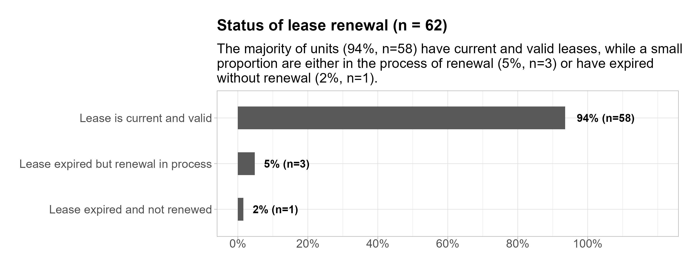

```


### Occupants compliance {.unnumbered}

- Most housing units are used strictly for residential purposes by immediate family and house help, showing adherence to intended use.

- Only a very small number of respondents reported ever sub‑leasing or assigning their unit to another person. Also, a small minority reported having boarders or lodgers.

- Overall, the data highlights that compliance with residential use rules is overwhelmingly high, with only minor exceptions reported.

```{r}
## subtitle text
subtitle_text <- str_wrap("Most housing units follow residential use rules, being occupied strictly by family members and house help. Only a very small number reported having boarders or engaging in sub‑leasing.", 70)


## plotting occupancy
p_occupancy <- 
    housing_dta |>
    select(housing_used_residential, house_boarders, house_sub_leased) |> 
    pivot_longer(
        cols = everything(),
        names_to = "question",
        values_to = "response"
    ) |> 
    count(question, response) |> 
    group_by(question) |> 
    n_pct() |> 
    ungroup() |> 
    mutate(description = case_when(
        str_detect(question, "boarders") ~ "Are there any boarders/lodgers (students or VSU employees) residing in the unit?",
        str_detect(question, "leased") ~ "Have you ever sub-leased or assigned your housing unit to another person?",
        str_detect(question, "residential") ~ "Is the housing unit used strictly for residential purposes by immediate family and house help only?"
    )) |> 
    mutate(description = str_wrap(description, 40)) |> 
    ggplot(aes(pct, description, fill = response)) +
    geom_col(position = position_dodge(preserve = "single")) +
    geom_text(aes(label = pct_lab), position = position_dodge(width = 0.9), hjust = -0.1) +
    scale_x_continuous(labels = percent_format(), limits = c(0, 1.2), breaks = seq(0, 1, 0.2)) +
    labs(
        subtitle = subtitle_text,
        title = "Occupancy and residential use compliance",
        x = NULL,
        y = NULL
    ) +
    custom_theme()


## save plot
ggsave(
    plot = p_occupancy,
    filename = "plot/occupancy.jpeg",
    units = "in",
    width = 10,
    height = 6,
    dpi = 300
)
  
# display plot
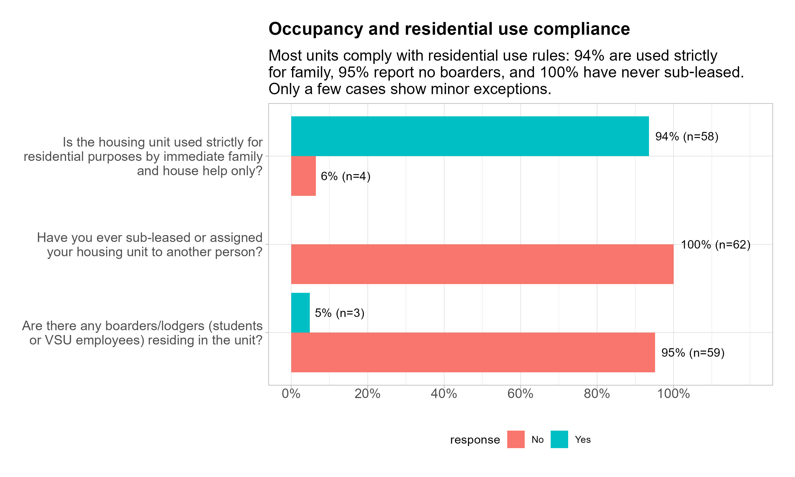
```


### Noise disturbance policy {.unnumbered}

-  The vast majority of housing units consistently follow noise regulations, reporting no disturbances.

- A small number of units occasionally experience minor noise issues. Only a very few units report frequent disturbances, showing that serious noise problems are uncommon.

- The data highlights that noise regulation compliance is high, with only minimal deviations.

```{r}
## subtitle text
subtitle_text <- str_wrap("Most units are consistently compliant with noise regulations, with 92% (n=145) reporting no disturbances. Only 6% occasionally and 1% frequently experience issues", 70)

## plotting noise disturbance
p_noise_disturbance <- 
    housing_dta |> 
    count(noise_disturbance) |> 
    n_pct() |> 
    mutate(noise_disturbance = fct_reorder(noise_disturbance, pct)) |> 
    ggplot(aes(pct, noise_disturbance)) +
    geom_col(width = 0.6) +
    geom_text(aes(label = pct_lab), hjust = -0.1, fontface = "bold", size = 4) +
    scale_x_continuous(labels = percent_format(), limits = c(0, 1.2), breaks = seq(0, 1, 0.25)) +
    coord_cartesian(expand = TRUE, clip = "off") +
    labs(
        title = glue("Noise disturbance compliance (n = {nrow(housing_dta)})"),
        subtitle = subtitle_text,
        x = NULL,
        y = NULL
    ) +
    custom_theme()

## save plot
ggsave(
    plot = p_noise_disturbance,
    filename = "plot/noise_disturbance.jpeg",
    units = "in",
    width = 10,
    height = 4,
    dpi = 300
)
  
# display plot
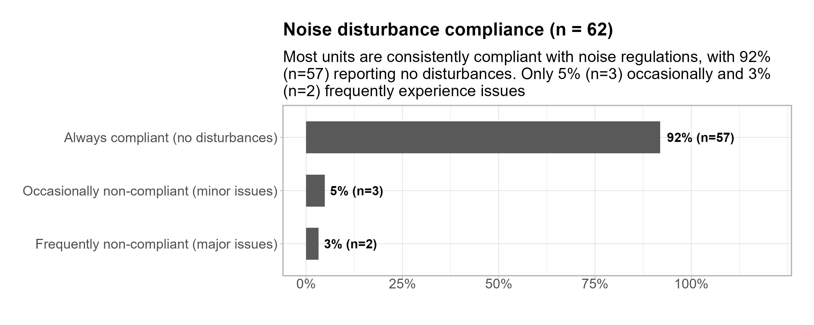

```

# Maintenance and services

### Frequency of repairs requested {.unnumbered}

-   Over half of respondents (54%, n=84) reported no repair requests in the past year,

-   About one‑third (37%, n=58) requested repairs 1–2 times and only 5% (n=8) reported 3–5 repair requests, and 4% (n=7) reported more than 5.

```{r}
title_plot <- glue("Frequency of repairs requested (n = {nrow(housing_dta)})")

subtitle_text <- str_wrap("Most respondents did not request any repairs in the past year, while a considerable portion asked for minor repairs once or twice. Only a small share experienced more frequent issues, requiring multiple repair interventions.", 80)

p_freq_repair <- plt_barplot(housing_dta, variable = repair_frequency, title_plot = title_plot)

## saving plot
ggsave(
    plot = p_freq_repair,
    filename = "plot/freq_repair.jpeg",
    units = "in",
    width = 10,
    height = 5,
    dpi = 300
)
  
# display plot
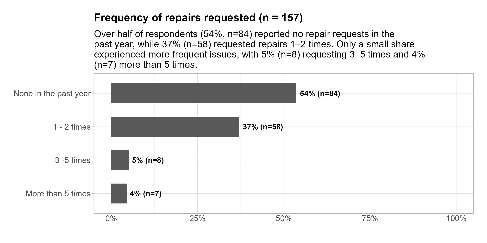
```


### Satisfaction on the timeliness of repair services {.unnumbered}

- Nearly half of respondents expressed a neutral stance toward the timeliness of repair services (45%, n=70).

- A significant portion reported being satisfied (27%, n=43), while a smaller group were very satisfied (8%, n=12).

- Dissatisfaction was noted by 11% (n=18), and 6% (n=10) reported being very dissatisfied. A small minority indicated the question was not applicable to them (3%, n=4).

```{r}
title_plot <- glue("How satisfied are you with the timeliness of repair services provided? (n = {nrow(housing_dta)})")

subtitle_text <- str_wrap("Responses show mixed levels of satisfaction, with many remaining neutral, some expressing satisfaction, and fewer reporting dissatisfaction.", 80)

p_sat_timeliness_repair <- plt_barplot(housing_dta, sat_timeliness_repair, title_plot)

## saving plot
ggsave(
    plot = p_sat_timeliness_repair,
    filename = "plot/sat_timeliness_repair.jpeg",
    units = "in",
    width = 10,
    height = 5,
    dpi = 300
)
  
# display plot
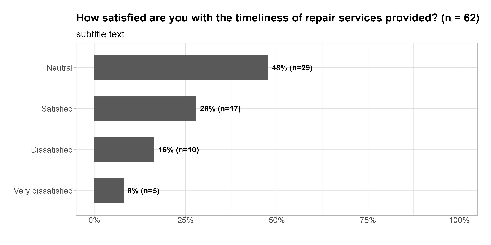
```


### Quality of repairs conducted {.unnumbered}

- The largest share of respondents described repairs as good, noting that only minor issues remained (44%, n=56).

- Nearly a quarter rated repairs as fair, suggesting that many fixes were only temporary (24%, n=30).

- A smaller group considered repairs excellent with issues fully resolved (13%, n=17), while an equal share felt repairs were poor and unresolved (13%, n=16).

- A small minority indicated the question was not applicable to them (6%, n=7).


```{r}
title_plot <- glue("Perceived quality of repairs provided (n = {nrow(housing_dta)})")

subtitle_text <- str_wrap("Most respondents rated repairs as good, with some viewing them as fair or excellent, while a smaller share felt repairs were poor or not applicable.", 70)

p_quality_repair <- plt_barplot(housing_dta, quality_repair, title_plot)

## saving plot
ggsave(
    plot = p_quality_repair,
    filename = "plot/quality_repair.jpeg",
    units = "in",
    width = 10,
    height = 4,
    dpi = 300
)
  
# display plot
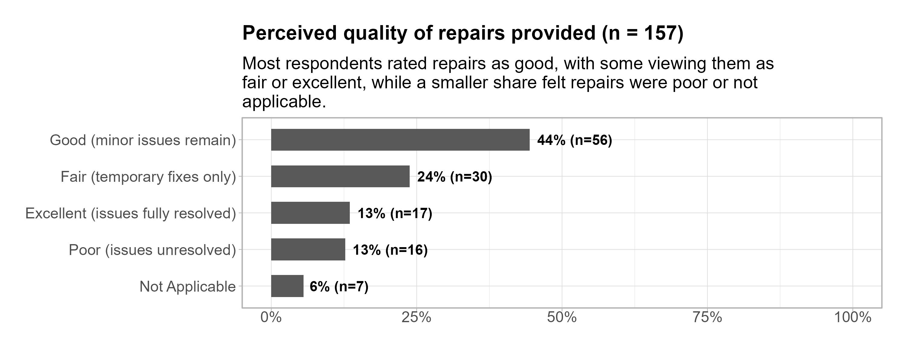
```


### Satisfaction with maintenance {.unnumbered}

- Most respondents consider the maintenance fee rates appropriate (72%, n=113). A notable portion expressed no opinion on the fee rates (21%, n=33).

- A small group felt the rates were too high (6%, n=9). Only a very few respondents believed the rates were too low (1%, n=2).


```{r}
title_plot <- glue("Satisfaction with maintenance fee rates (n = {nrow(housing_dta)})")

subtitle_text <- str_wrap("Most respondents consider the maintenance fee rates reasonable, while some expressed no opinion and only a few viewed them as either too high or too low.", 70)

p_sat_maintenance_fee <- plt_barplot(housing_dta, sat_maintenance_fee, title_plot)

## saving plot
ggsave(
    plot = p_sat_maintenance_fee,
    filename = "plot/sat_maintenance_fee.jpeg",
    units = "in",
    width = 10,
    height = 4,
    dpi = 300
)
  
# display plot
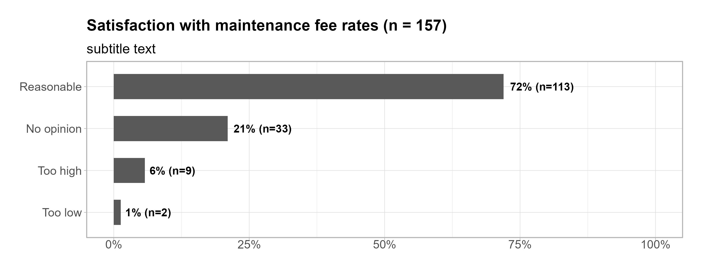
```


### Reliability of utility services {.unnumbered}

- The majority of respondents identified water supply as the most consistently reliable service. A significant share also recognized garbage collection as dependable.

- While electricity was reported as reliable by many, though slightly less than water and garbage services. 

- Overall data highlights strong confidence in the reliability of essential services, with water supply leading, and only a negligible portion expressing complete dissatisfaction.

```{r}
title_plot <- glue("In terms of the utility services provided by the university,\nwhich services are consistently reliable? (n = {nrow(housing_dta)})")

subtitle_text <- str_wrap("Water supply is viewed as the most consistently reliable service, followed by garbage collection and electricity, with very few respondents indicating that none are dependable.", 70)

serv_reliability_dta <- 
    housing_dta |> 
    select(services_reliability) |> 
    mutate(services_reliability = str_split(services_reliability, ",")) |> 
    unnest() |> 
    mutate(services_reliability = str_trim(services_reliability)) |> 
    filter(!str_detect(services_reliability, "i have")) |> 
    mutate(services_reliability = if_else(services_reliability == "for water supply", "Water Supply", services_reliability))


p_service_reliability <- plt_barplot(serv_reliability_dta, services_reliability, title_plot)

## saving plot
ggsave(
    plot = p_service_reliability,
    filename = "plot/service_reliability.jpeg",
    units = "in",
    width = 10,
    height = 5,
    dpi = 300
)
  
# display plot
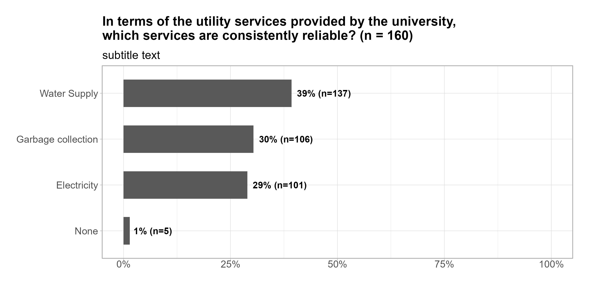
```


### Energy subsidy awareness {.unnumbered}

- - Most respondents indicated they are aware of the electricity subsidy and its scheduled reduction and eventual removal (68%, n=107).

- A significant share reported being unaware of the subsidy and its future changes (32%, n=50).


```{r}
## subtitle text
subtitle_text <- str_wrap("A majority of respondents are aware of the electricity subsidy and its planned reduction, while a notable portion remain unaware of the upcoming changes.", 80)

p_electric_subsidy <- 
    housing_dta |> 
    select(electric_subsidy) |> 
    count(electric_subsidy) |> 
    n_pct() |> 
    mutate(pct_lab = str_wrap(pct_lab, 2)) |> 
    ggplot(aes(x = 2, y = pct, fill = electric_subsidy)) +
    geom_col(width = 1, color = "white", show.legend = T) +
    coord_polar(theta = "y") +
    xlim(0.7, 2.5) +
    geom_text(aes(label = pct_lab), 
            position = position_stack(vjust = 0.5), 
            color = "white", size = 5, fontface = "bold") +
    labs(
        title = str_wrap("Are you aware of the 100 kW electricity subsidy (to be reduced to 50 kW in 2026–2030 and removed thereafter)?", 60),
        subtitle = subtitle_text,
        fill = "Response",
        x = NULL,
        y = NULL
    ) +
    custom_theme() +
    theme(
        plot.margin = margin(10, 10, 10, 10),
        plot.title.position = "plot",
        panel.grid = element_blank(),
        panel.border = element_blank(),
        axis.text = element_text(color = "white"),
        legend.position = "right"
    )

## saving plot
ggsave(
    plot = p_electric_subsidy,
    filename = "plot/electric_subsidy.jpeg",
    units = "in",
    width = 8,
    height = 6,
    dpi = 300
)
  
# display plot
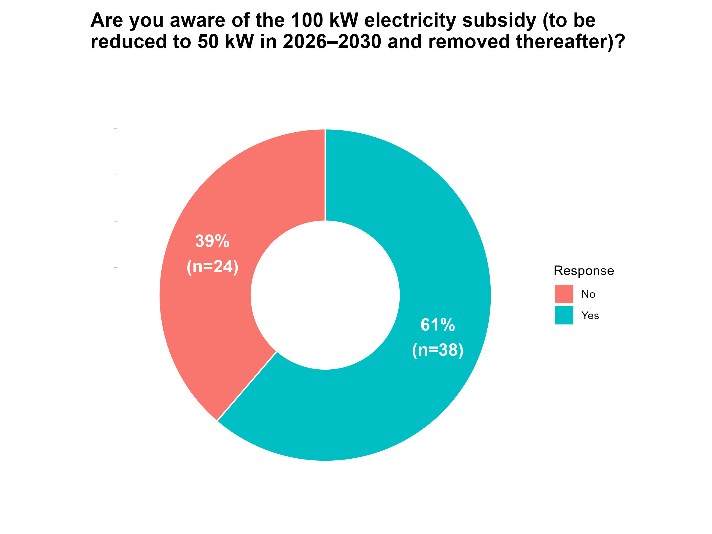
```


### Unit improvements and extensions {.unnumbered}

- Over half of respondents reported making modifications or extensions to their housing units (54%, n=85).

- Only a small share secured approval from the General Services Office (12%, n=19), while most indicated this was not applicable (78%, n=123).

- A strong majority recognized that all improvements become university property upon turnover (91%, n=143).

- Most improvements did not alter the basic design of the housing unit (85%, n=133).

- Few respondents obtained a written permit before starting improvements (10%, n=16), while a larger group admitted not securing one (22%, n=35).

- Overall trend, data shows active engagement in unit improvements, paired with high awareness of property rules, but weaker compliance with formal approval and permitting processes.

```{r}
## subtitle text
subtitle_text <- str_wrap("Many residents reported making improvements to their housing units, with most acknowledging university ownership of modifications. However, securing permits and approvals was less consistently observed.", 80)

p_housing_improv <- 
    housing_dta |> 
    select(housing_made_improvements, permit_improvement,
    approved_extension, improvement_alter_unit, improvement_turnover) |> 
    pivot_longer(
        cols = everything(),
        names_to = "question",
        values_to = "response"
    ) |> 
    count(question, response) |> 
    group_by(question) |> 
    n_pct() |> 
    ungroup() |> 
    mutate(description = case_when(
        str_detect(question, "permit") ~ "Did you secure a written permit before starting the improvements?",
        str_detect(question, "turnover") ~ "Do you understand that all improvements become university property upon turnover?",
        str_detect(question, "alter_unit") ~ "Do the improvements alter the basic design of the housing unit?",
        str_detect(question, "housing_made") ~ "Have you made any improvements or extensions to your housing unit?",
        str_detect(question, "approved_") ~ "Was the extension approved by the General Services Office?"
    )) |>
    mutate(description = str_wrap(description, 40)) |>
    mutate(pct_lab = str_wrap(pct_lab, 3)) |> 
    ggplot(aes(pct, description, fill = response)) +
    geom_col(width = 0.8) +
    geom_text(aes(label = pct_lab), position = position_fill(vjust = 0.2), hjust = -0, fontface = 'bold', size = 4, color = "white") +
    scale_x_continuous(labels = percent_format(), limits = c(0, 1), breaks = seq(0, 1, 0.2)) +
    scale_fill_manual(values = c("#ed6a5a", "#243e36", "#064789")) +
    guides(fill = guide_legend(reverse = TRUE)) +
    labs(
        subtitle = subtitle_text,
        title = "Unit improvements and extensions ",
        x = NULL,
        y = NULL
    ) +
    custom_theme()

## saving plot
ggsave(
    plot = p_housing_improv,
    filename = "plot/housing_improv.jpeg",
    units = "in",
    width = 10,
    height = 6,
    dpi = 300
)
  
# display plot
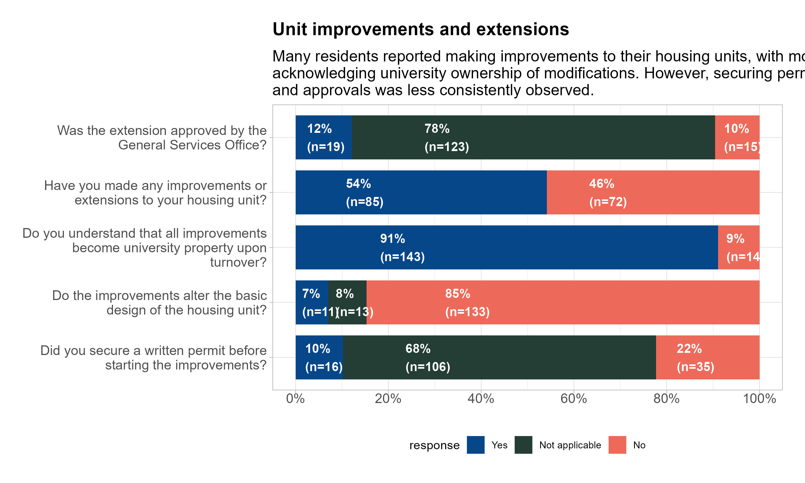
```


### Condition of improvement {.unnumbered}

- Nearly half of the improvements were rated as good, showing only minor wear and tear (48%, n=55). A quarter of respondents described their improvements as excellent, highlighting safe and well-kept conditions (25%, n=29).

- A smaller share reported fair condition, indicating repairs are needed (14%, n=16). Only a few improvements were considered poor, unsafe, or deteriorating (5%, n=6).

- A small portion of respondents indicated the question did not apply to them (8%, n=9).

```{r}
title_plot <- glue("Condition of improvements (n = {nrow(housing_dta)})")
subtitle_text <- str_wrap("Most improvements are in good or excellent condition, with fewer requiring repairs or showing signs of deterioration.", 70)

p_improve_condition <- plt_barplot(housing_dta, improvement_condition, title_plot)

## saving plot
ggsave(
    plot = p_improve_condition,
    filename = "plot/improve_condition.jpeg",
    units = "in",
    width = 10,
    height = 4,
    dpi = 300
)
  
# display plot
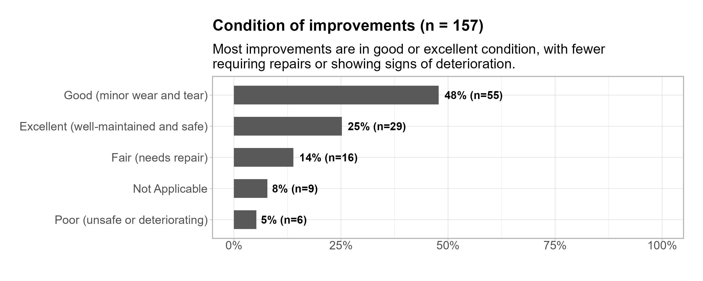
```


# Future needs and feedbacks

### Services and amenities needs {.unnumbered}

- Over a third of respondents expressed a strong preference for free Internet/Wi-Fi (35%, n=90).

- Recreational areas (19%, n=49) and garden/green spaces (19%, n=47) were equally sought after, highlighting interest in shared and natural environments.

- Additional storage (11%, n=27) and laundry areas (7%, n=18) were requested by smaller groups, reflecting functional priorities.

- Very few respondents mentioned kitchens (2%, n=4), fire extinguishers (1%, n=3), or gave no answer.

- Only a small fraction indicated no desired amenities (combined ~5%, n≈13 across “None,” “none,” and “NONE”).

```{r}
title_plot <- glue("Services and ameneties wished by occupants (n = {nrow(housing_dta)})")
subtitle_text <- str_wrap("Free Internet/Wi-Fi is the most desired amenity, followed by recreational and green spaces, with fewer requests for storage, laundry, and other facilities.", 70)

serv_ameneties_dta <- 
    housing_dta |> 
    select(wish_ameneties) |> 
    mutate(wish_ameneties = str_split(wish_ameneties, ",")) |> 
    unnest(cols= c(wish_ameneties)) |> 
    mutate(wish_ameneties = str_trim(wish_ameneties)) |>  
    mutate(wish_ameneties = case_when(
        str_detect(wish_ameneties, "park|play") ~ "Recreational space",
        str_detect(wish_ameneties, "fire|Fire") ~ "Fire extinguisher",
        str_detect(wish_ameneties, "kitchen|Kitchen|cooking") ~ "Kitchen",
        str_detect(wish_ameneties, "garden|backyard") ~ "Garden/green space",
        str_detect(wish_ameneties, "laundry") ~ "Laundry Area",
        TRUE ~ wish_ameneties
    ))

p_serv_ameneties <- plt_barplot(serv_ameneties_dta, wish_ameneties, title_plot)

# saving plot
ggsave(
    plot = p_serv_ameneties,
    filename = "plot/serv_ameneties.jpeg",
    units = "in",
    width = 10,
    height = 6,
    dpi = 300
)
  
# display plot
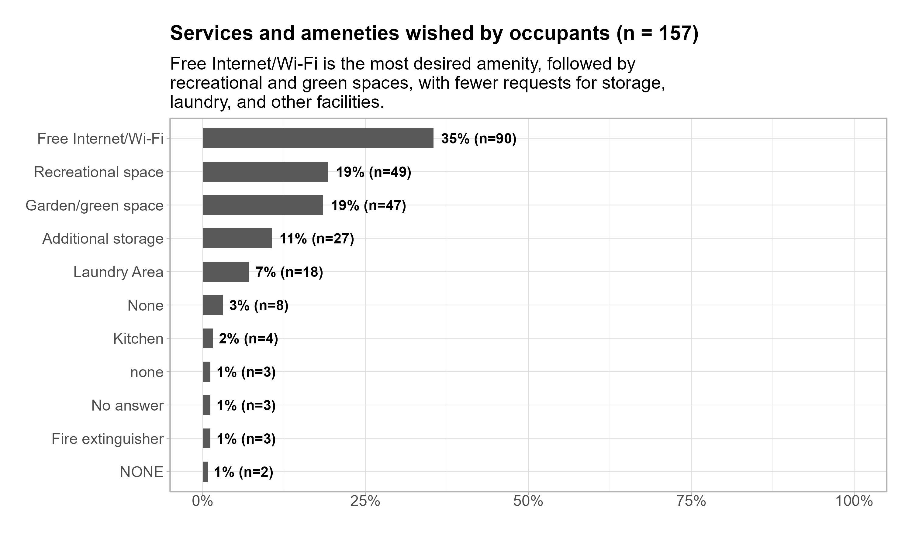
```


### Fairness and transparancy of housing policies {.unnumbered}

- Nearly half of respondents agreed that current housing policies are fair and transparent (46%, n=72). A substantial portion neither agreed nor disagreed, reflecting uncertainty or mixed perceptions (35%, n=55).

- A smaller group strongly agreed with the fairness and transparency of policies (13%, n=20). Only a few respondents expressed disagreement (6%, n=10).

```{r}
title_plot <- glue("Do you feel the current housing policies are fair and transparent? (n = {nrow(housing_dta)})")

subtitle_text <- str_wrap("Most respondents view housing policies as fair and transparent, though many remain neutral, with fewer expressing strong agreement or disagreement.", 80)

p_housing_policies_fair <- plt_barplot(housing_dta, housing_policies_fair, title_plot)

## save plot
ggsave(
    plot = p_housing_policies_fair,
    filename = "plot/housing_policies_fair.jpeg",
    units = "in",
    width = 10,
    height = 4,
    dpi = 300
)
  
# display plot
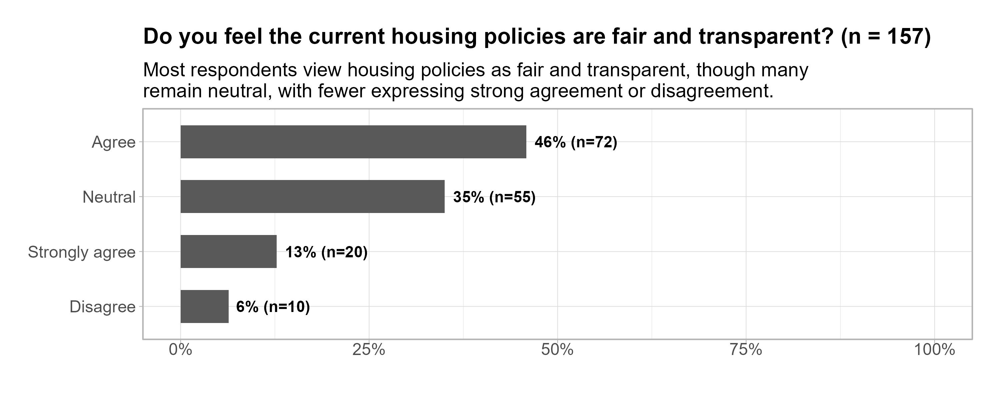
```


### VSU housing overall satisfaction {.unnumbered}

- Over half of respondents reported being satisfied with VSU housing services (52%, n=81).

- Nearly a third expressed neutrality, neither satisfied nor dissatisfied (30%, n=47).

- A smaller group indicated they were very satisfied (15%, n=23). Only a few respondents reported dissatisfaction (3%, n=5).


```{r}
title_plot <- glue("How would you rate your overall satisfaction with\nVSU housing services?(n = {nrow(housing_dta)})")
subtitle_text <- str_wrap("Most respondents are satisfied with housing services, with fewer expressing strong satisfaction or dissatisfaction, and a notable share remaining neutral.", 80)

p_overall_sat <- plt_barplot(housing_dta, overall_satisfaction, title_plot)

## save plot
ggsave(
    plot = p_overall_sat,
    filename = "plot/overall_sat.jpeg",
    units = "in",
    width = 10,
    height = 4,
    dpi = 300
)
  
# display plot
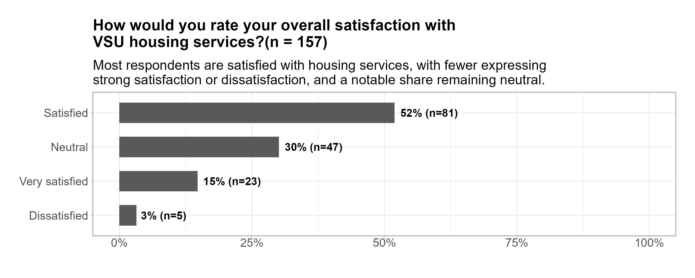
```
